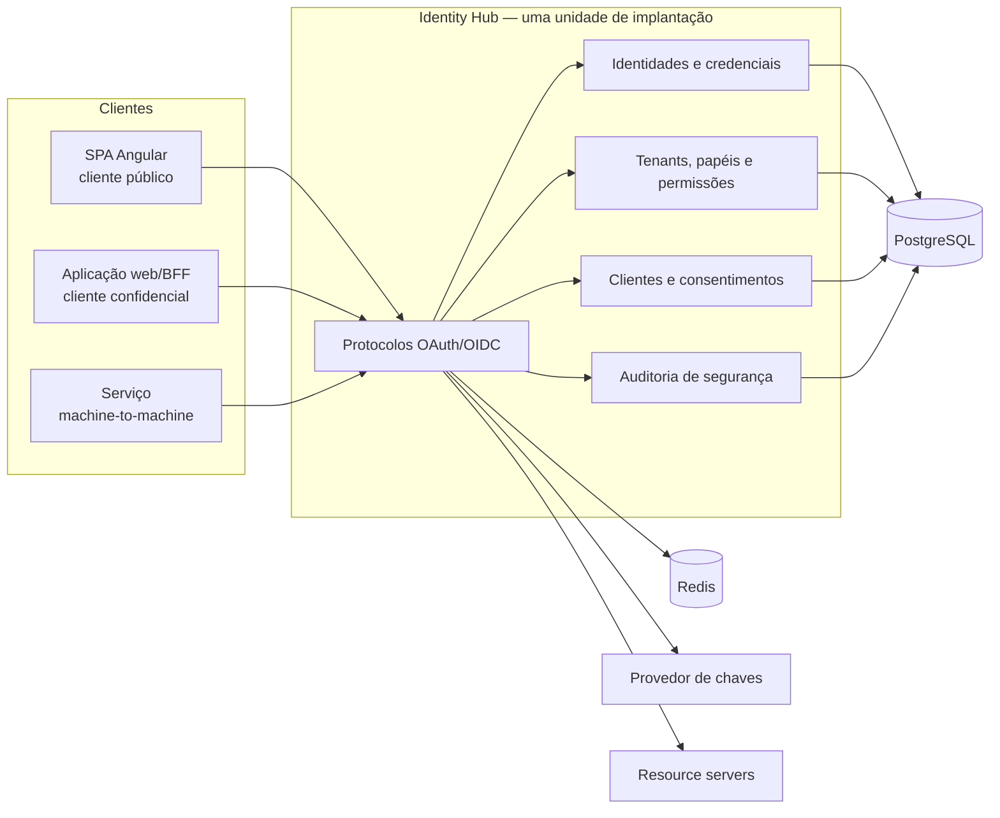

# Identity Hub

Provedor de identidade e acesso empresarial construído com Java e Spring para
demonstrar, de ponta a ponta, como autenticação, autorização e federação devem
ser tratadas além da simples emissão de um JWT.

O projeto será desenvolvido como um **monólito modular**, com limites internos
explícitos e uma única unidade de implantação inicial. A solução pretende
oferecer OAuth 2.0, OpenID Connect e um perfil de segurança alinhado às
recomendações modernas associadas ao OAuth 2.1, sem transformar cada bounded
context em um microsserviço artificial.

> **Estado atual:** fundação documental e scaffolds adicionados. O repositório
> já contém um backend Spring Boot e um frontend Angular/TailAdmin, ainda sem
> fluxo OAuth/OIDC, login ou consentimento integrados. O
> [roadmap](docs/roadmap.md) diferencia claramente o que está concluído do que
> está apenas planejado.

## Objetivo

O Identity Hub será uma referência pública de servidor de autorização e
provedor OpenID Connect capaz de atender aplicações web, SPAs, backends e
integrações máquina a máquina.

O projeto deve comprovar:

- domínio de Java, Spring Boot, Spring Security e Spring Authorization Server;
- entendimento dos limites de confiança entre navegador, cliente público,
  cliente confidencial, servidor de autorização e resource server;
- aplicação correta de Authorization Code com PKCE, Client Credentials,
  refresh tokens, revogação, discovery e JWK Set;
- modelagem de usuários, credenciais, tenants, memberships, papéis, permissões
  e clientes OAuth;
- decisões explícitas sobre consistência, concorrência, idempotência,
  auditoria, cache e proteção de dados sensíveis;
- capacidade de evoluir um sistema empresarial sem complexidade distribuída
  prematura.

## Escopo funcional planejado

### Protocolos e sessões

- OAuth 2.0 e OpenID Connect 1.0;
- Authorization Code com PKCE obrigatório para clientes públicos;
- Client Credentials para integrações serviço a serviço;
- refresh token com rotação e detecção de reutilização;
- revogação e introspecção quando aplicável ao tipo de token;
- discovery metadata, UserInfo, JWK Set e logout;
- consentimento explícito quando o cliente ou o escopo exigir;
- gestão de sessões e encerramento centralizado.

### Identidades e acesso

- cadastro, ativação, suspensão e recuperação de conta;
- verificação de e-mail;
- bloqueio progressivo por tentativas inválidas;
- MFA opcional, iniciado por TOTP;
- RBAC com permissões granulares;
- memberships e administração por tenant;
- provisionamento administrativo e trilha de alterações;
- aplicação Angular de administração e cliente SPA demonstrativo.

### Operação e segurança

- PostgreSQL como fonte de verdade;
- Redis para dados efêmeros, rate limiting e coordenação com semântica
  explicitamente documentada;
- chaves assimétricas fora do código-fonte e rotação sem interrupção;
- auditoria append-only de eventos relevantes;
- métricas, logs estruturados e traces com OpenTelemetry;
- migrações versionadas, testes automatizados e pipeline no GitHub Actions;
- execução local reproduzível com Docker Compose.

## Princípios arquiteturais

1. **Protocol first:** endpoints e respostas seguem padrões publicados; regras
   proprietárias ficam fora do núcleo dos protocolos.
2. **Seguro por padrão:** PKCE, redirect URIs exatas, senhas com hash forte,
   segredos não versionados e menor privilégio não são opcionais.
3. **Monólito modular primeiro:** módulos lógicos não implicam processos,
   bancos ou deploys independentes.
4. **Fonte de verdade explícita:** PostgreSQL guarda estado durável; Redis não
   substitui consistência transacional.
5. **Tenancy no domínio:** tenant não será apenas um filtro adicionado no fim do
   projeto.
6. **Auditoria sem vazamento:** registrar decisões e resultados de segurança,
   nunca senhas, códigos, tokens, secrets ou material criptográfico privado.
7. **Evidência antes de alegação:** um item só é marcado como entregue após
   testes e documentação compatíveis com seu risco.

## Arquitetura pretendida



A visão completa, os limites dos módulos e os fluxos de confiança estão em
[Visão de arquitetura](docs/architecture/overview.md).

## Módulos lógicos previstos

| Módulo | Responsabilidade |
| --- | --- |
| `Identity` | usuários, credenciais, recuperação, bloqueio e MFA |
| `Tenancy` | tenants, memberships, contexto e isolamento |
| `AccessControl` | papéis, permissões e políticas administrativas |
| `OAuthClient` | clientes, redirect URIs, escopos e consentimentos |
| `AuthorizationServer` | endpoints e composição dos protocolos OAuth/OIDC |
| `KeyManagement` | ciclo de vida de chaves públicas e privadas |
| `SecurityAudit` | eventos de autenticação, autorização e administração |
| `Administration` | casos de uso e API da operação administrativa |

Esses nomes representam fronteiras lógicas. A estrutura final de pacotes será
validada no primeiro incremento e não precisa reproduzir uma camada por pasta
quando isso não trouxer isolamento real.

## Estratégia de entrega

O desenvolvimento seguirá **fatias verticais**. Cada incremento deve incluir o
comportamento de domínio, persistência, endpoint, segurança, migração, testes e
documentação necessários para produzir uma capacidade executável.

Exemplo da primeira fatia:

1. aplicação Spring inicial e infraestrutura local;
2. usuário administrativo de desenvolvimento provisionado com segurança;
3. cliente público cadastrado;
4. login e consentimento;
5. Authorization Code com PKCE;
6. emissão e validação de ID token e access token;
7. discovery e JWK Set;
8. teste de integração do fluxo completo.

CQRS será usado apenas onde modelos de leitura e escrita tiverem necessidades
materialmente diferentes. Eventos de domínio não serão usados como sinônimo de
mensageria, e RabbitMQ só será introduzido quando existir uma integração
assíncrona real.

## Estrutura do repositório

```text
identity-hub/
├── README.md
├── docs/
│   ├── architecture/
│   │   └── overview.md
│   ├── adr/
│   │   ├── README.md
│   │   ├── 001-modular-monolith.md
│   │   ├── 002-protocol-first-authorization-server.md
│   │   ├── 003-client-types-and-pkce.md
│   │   ├── 004-multi-tenancy-and-issuer-strategy.md
│   │   ├── 005-token-and-key-lifecycle.md
│   │   ├── 006-persistence-cache-and-consistency.md
│   │   └── 007-security-audit-and-sensitive-data.md
│   └── roadmap.md
├── Backend/      # scaffold Spring Boot existente
├── Frontend/     # scaffold Angular/TailAdmin existente
└── compose.yaml  # planejado
```

## Decisões arquiteturais

- [ADR-001: monólito modular como unidade inicial de implantação](docs/adr/001-modular-monolith.md)
- [ADR-002: servidor de autorização orientado por padrões](docs/adr/002-protocol-first-authorization-server.md)
- [ADR-003: tipos de cliente e PKCE](docs/adr/003-client-types-and-pkce.md)
- [ADR-004: multi-tenancy e estratégia de issuer](docs/adr/004-multi-tenancy-and-issuer-strategy.md)
- [ADR-005: ciclo de vida de tokens e chaves](docs/adr/005-token-and-key-lifecycle.md)
- [ADR-006: persistência, cache e consistência](docs/adr/006-persistence-cache-and-consistency.md)
- [ADR-007: auditoria e dados sensíveis](docs/adr/007-security-audit-and-sensitive-data.md)
- [ADR-008: TailAdmin como interface de login e consentimento](docs/adr/008-tailadmin-authorization-interaction-ui.md)

## Referências normativas e técnicas

- [OpenID Connect Core 1.0](https://openid.net/specs/openid-connect-core-1_0.html)
- [OAuth 2.0 Authorization Framework — RFC 6749](https://www.rfc-editor.org/rfc/rfc6749)
- [PKCE — RFC 7636](https://www.rfc-editor.org/rfc/rfc7636)
- [OAuth 2.0 Security Best Current Practice — RFC 9700](https://www.rfc-editor.org/rfc/rfc9700)
- [OAuth 2.0 Authorization Server Metadata — RFC 8414](https://www.rfc-editor.org/rfc/rfc8414)
- [OAuth 2.0 Token Revocation — RFC 7009](https://www.rfc-editor.org/rfc/rfc7009)
- [JWT Profile for OAuth 2.0 Access Tokens — RFC 9068](https://www.rfc-editor.org/rfc/rfc9068)
- [Spring Authorization Server](https://docs.spring.io/spring-authorization-server/reference/)

## Como acompanhar

O [roadmap](docs/roadmap.md) contém as fatias planejadas, critérios de aceite e
evidências esperadas. ADRs registram decisões duradouras; o roadmap registra
sequência e progresso. Mudanças arquiteturais relevantes devem atualizar ambos,
sem reescrever silenciosamente o histórico de uma decisão aceita.

## Licença

Distribuído sob a licença MIT. Consulte o arquivo [LICENSE](LICENSE).
