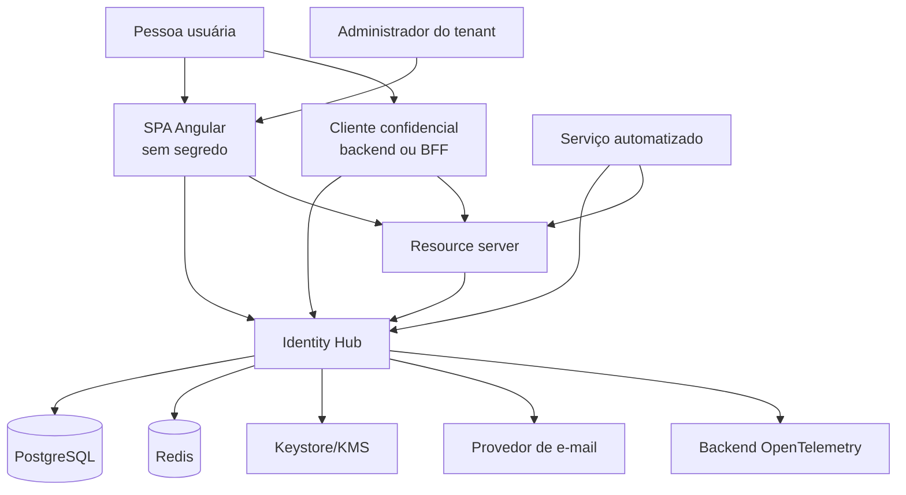
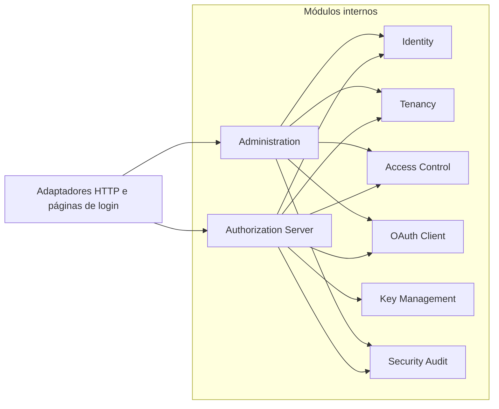
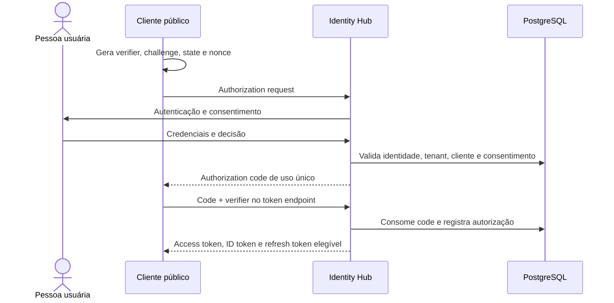

# Visão de arquitetura

## Contexto

O Identity Hub é um provedor de identidade e servidor de autorização para
aplicações humanas e integrações máquina a máquina. Ele autentica identidades,
mantém relações de acesso por tenant e emite credenciais verificáveis para
resource servers.

O sistema está no estágio de documentação. Esta página descreve a arquitetura
pretendida e seus invariantes; não afirma que os componentes já existem.

## Objetivos arquiteturais

- conformidade com OAuth 2.0 e OpenID Connect;
- perfil de segurança moderno, alinhado ao BCP do OAuth;
- isolamento de tenant aplicado desde persistência até tokens e auditoria;
- evolução modular sem custo operacional distribuído prematuro;
- rotação de chaves e tokens sem interrupção indevida de sessões válidas;
- rastreabilidade de decisões de segurança sem registrar credenciais;
- ambiente local e pipeline reproduzíveis.

## Restrições e não objetivos iniciais

- não criar um protocolo proprietário de autenticação;
- não implementar grant de senha;
- não suportar implicit grant;
- não aceitar redirect URI por correspondência parcial ou curinga;
- não usar JWT como substituto universal de sessão, autorização e auditoria;
- não separar módulos em microsserviços na primeira versão;
- não oferecer federação social, SCIM, SAML ou WebAuthn no MVP;
- não prometer alta disponibilidade antes de testes operacionais específicos.

## Contexto e relações de confiança

Limites importantes:

- o navegador é ambiente não confiável e não guarda client secret;
- um cliente OAuth não recebe acesso só porque autentica corretamente;
- o resource server valida issuer, audience, assinatura, tempo e escopos;
- Redis é dependência operacional, não fonte de verdade de identidades;
- o provedor de e-mail recebe apenas o necessário para entregar mensagens;
- material privado de assinatura não entra no banco como configuração comum.

## Unidade de implantação

O backend começa como uma aplicação Spring Boot única. Os módulos possuem
fronteiras de código e propriedade de dados, mas compartilham processo,
pipeline e banco PostgreSQL.

Comunicação interna direta é preferível a mensageria quando faz parte da mesma
operação. Eventos de domínio podem desacoplar efeitos dentro do processo.
Outbox e RabbitMQ só entram quando uma integração externa assíncrona exigir
entrega durável.

## Responsabilidade dos módulos

### Identity

Mantém usuário, identificadores normalizados, credenciais, estado da conta,
tentativas inválidas, recuperação e fatores adicionais. Não conhece detalhes de
redirect URI ou consentimento OAuth.

### Tenancy

Mantém tenants, memberships, estado de vínculo e resolução segura do contexto.
Um usuário global pode possuir memberships distintas. Toda operação
tenant-scoped exige tenant resolvido e membership válida.

### Access Control

Mantém papéis e permissões administrativas. Escopos OAuth e permissões de
negócio são conceitos relacionados, mas não intercambiáveis.

### OAuth Client

Mantém registro de clientes, métodos de autenticação, redirect URIs exatas,
grant types autorizados, escopos e política de consentimento.

### Authorization Server

Compõe os módulos anteriores para executar endpoints padronizados, emitir
tokens, publicar metadata e atender UserInfo. A biblioteca Spring Authorization
Server é a base do protocolo; customizações devem ficar em pontos de extensão
suportados.

### Key Management

Seleciona chave ativa, publica apenas material público, preserva chaves antigas
durante a janela necessária e registra rotação. A origem do material privado
varia por ambiente, sem mudar o contrato do módulo.

### Security Audit

Registra eventos de autenticação, consentimento, token, credencial,
administração e detecção de abuso. O evento descreve ação, resultado, sujeito,
tenant, cliente, correlação e contexto seguro.

### Administration

Expõe casos de uso administrativos com autorização explícita. Não acessa
diretamente tabelas pertencentes a outro módulo; usa contratos internos.

## Fluxos principais

### Authorization Code com PKCE

Invariantes:

- `state` protege a correlação no cliente e `nonce` vincula o ID token;
- authorization code é curto, de uso único e vinculado a cliente, redirect URI
  e code challenge;
- cliente público usa PKCE com `S256` e não recebe segredo;
- redirect URI deve corresponder exatamente ao registro;
- tokens e códigos nunca aparecem em logs.

### Refresh token com rotação

Cada uso válido invalida o refresh token apresentado e cria um sucessor na
mesma família. A reutilização de um token já consumido revoga a família
afetada, produz auditoria e força nova autenticação conforme a política.
Concorrência legítima deve ser tratada de forma atômica para não emitir dois
sucessores.

### Client Credentials

O sujeito é o próprio cliente, não uma pessoa. O token não carrega identidade
humana fictícia. Apenas clientes confidenciais autorizados, com autenticação
adequada e escopos previamente concedidos, podem usar esse grant.

## Multi-tenancy

O modelo inicial usa identidade global e membership por tenant. Entidades
tenant-scoped carregam `tenant_id`, com índices e unicidades incluindo essa
chave.

O tenant será selecionado em contexto autenticado ou em etapa controlada do
fluxo; um cabeçalho fornecido livremente pelo chamador não constitui prova de
tenant. Tokens destinados a resource servers tenant-aware carregarão um claim
de tenant documentado e uma audience específica.

O MVP começa com um issuer canônico único. Issuer por tenant permanece uma
evolução condicionada a necessidade real, porque afeta discovery, validação,
chaves, clientes, cookies e operação. A decisão completa está no
[ADR-004](../adr/004-multi-tenancy-and-issuer-strategy.md).

## Dados e consistência

PostgreSQL é a fonte de verdade para identidades, clientes, autorizações,
consentimentos, memberships, chaves registradas e auditoria.

Redis poderá armazenar:

- contadores de rate limiting;
- desafios ou estados efêmeros com TTL;
- dados revogáveis de sessão;
- caches reconstruíveis.

Uma indisponibilidade do Redis deve produzir comportamento fail-safe definido
por caso de uso. Nenhum fluxo crítico pode conceder acesso porque o cache não
respondeu.

Operações sensíveis usam concorrência otimista ou locks transacionais conforme
o invariante. Rotação de refresh token, consumo de código e bootstrap
administrativo exigem atomicidade.

## Tokens e chaves

- access tokens JWT assinados assimetricamente são o padrão inicial;
- ID tokens são emitidos apenas em fluxos OpenID Connect;
- claims têm contrato mínimo, audience explícita e nenhum dado sensível
  desnecessário;
- refresh tokens são opacos e persistidos de forma não recuperável quando a
  biblioteca e o modelo permitirem;
- JWK Set publica chave atual e chaves anteriores ainda necessárias;
- rotação possui períodos de publicação, ativação, retirada e destruição;
- ambientes locais podem usar keystore de desenvolvimento, nunca reutilizado em
  produção.

## Auditoria e observabilidade

Logs operacionais, traces e auditoria têm finalidades diferentes:

- logs ajudam a diagnosticar a aplicação;
- traces correlacionam trabalho entre componentes;
- métricas revelam volume, latência, erro e abuso;
- auditoria registra fatos de segurança com retenção e acesso controlados.

Identificadores de correlação podem atravessar essas superfícies. Tokens,
senhas, secrets, cookies, códigos, verifiers, OTPs e chaves privadas não podem.

## Estratégia de testes

Cada fatia vertical deverá combinar:

- testes unitários de invariantes;
- testes de integração com PostgreSQL e, quando necessário, Redis;
- testes de protocolo para erros e respostas padronizadas;
- testes de concorrência para códigos, refresh tokens e bloqueios;
- testes de autorização por tenant e permissão;
- testes negativos para redirect URI, audience, issuer, PKCE e replay;
- análise de dependências e configuração;
- fluxo de navegador para o cliente Angular quando ele existir.

## Evolução

Uma extração futura para serviço independente só será considerada com evidência
de necessidade, como escala, isolamento operacional, requisitos regulatórios ou
cadência de entrega incompatível. A extração deve respeitar propriedade de
dados, contratos versionados, observabilidade e falhas distribuídas; contagem de
módulos não é justificativa.
