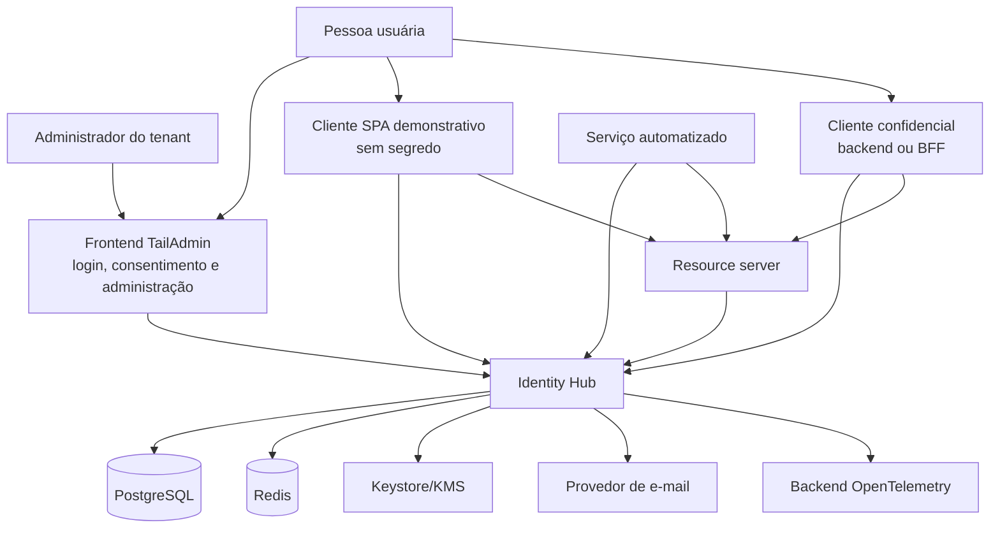
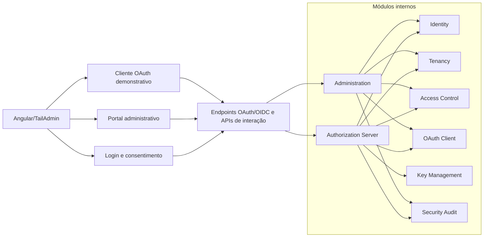
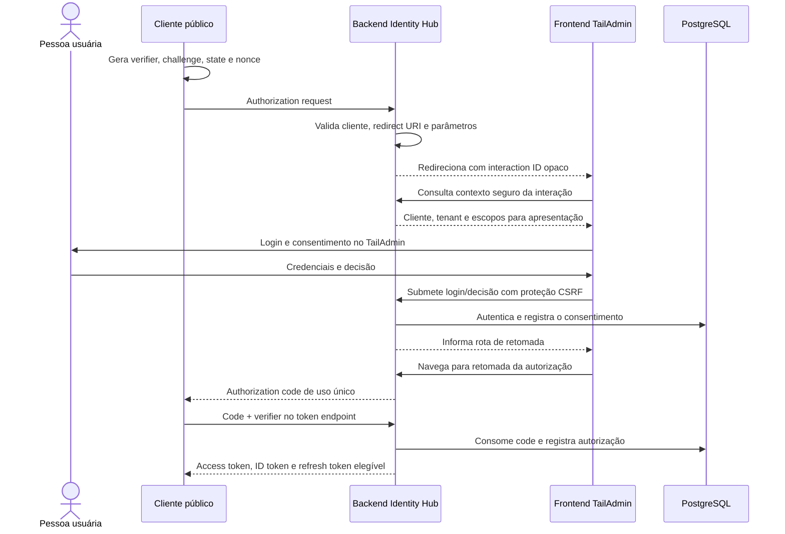

# Visão de arquitetura

## Contexto

O Identity Hub é um provedor de identidade e servidor de autorização para
aplicações humanas e integrações máquina a máquina. Ele autentica identidades,
mantém relações de acesso por tenant e emite credenciais verificáveis para
resource servers.

O repositório contém um backend Spring Boot 4.0.7/Java 17 e um frontend Angular
21 baseado no TailAdmin. As vinte e nove primeiras fatias verticais implementam
Authorization Code com PKCE, login e consentimento por interação opaca,
persistência PostgreSQL, metadata, JWK Set, ID token, access token, UserInfo e
uma API protegida por issuer, audience e escopo. Refresh tokens opacos são
rotacionados em famílias transacionais, com replay, revogação, métricas
Prometheus protegidas e falha fechada diante da indisponibilidade da
persistência. A fundação de tenancy persiste organizações e memberships e
resolve os vínculos ativos pelo sujeito de um access token validado. Um catálogo
versionado define as capacidades administrativas conhecidas. Papéis pertencem
a um único tenant, agregam permissões e são atribuídos às memberships com
integridade referencial contra cruzamento de tenants. As primeiras mutações
administrativas de membership exigem access token com audience e scope próprios
e também a permissão efetiva `tenant.access.manage` em uma membership ativa do
ator no tenant da rota. Clientes OAuth públicos agora pertencem explicitamente
a um tenant e podem ser criados, consultados, atualizados e removidos por API,
com PKCE e consentimento obrigatórios, redirect URIs exatas e escopos
permitidos. A primeira superfície administrativa Angular autentica pelo mesmo
cliente público usando um callback dedicado, mantém o access token apenas em
memória, recupera a sessão por refresh token rotativo e habilita leitura ou
gestão conforme as permissões do tenant selecionado. As mutações
administrativas existentes produzem eventos append-only com ator,
tenant, alvo, resultado, motivo normalizado e correlação, consultáveis apenas
com `security.audit.read` no próprio tenant. Uma suíte negativa integrada
exercita as fronteiras de usuário, administrador, cliente OAuth, membership e
auditoria, incluindo tentativas de usar identificadores estrangeiros sob uma
rota autorizada. O cadastro público cria uma identidade global pendente,
entrega por SMTP um link de verificação com token de uso único armazenado
somente como hash e impede autenticação antes da confirmação. A recuperação de
senha também usa tokens opacos persistidos apenas como hash, expira em 15
minutos, revoga solicitações anteriores e não diferencia contas em respostas
públicas. O login persiste falhas por identidade e aplica bloqueio temporário
progressivo de um a quinze minutos a partir da quinta falha. A resposta pública permanece
genérica e tentativas durante o bloqueio não renovam o prazo. Novas senhas
seguem uma política central de frases longas e bloqueio contextual, usam
Argon2id com custo de memória e migram hashes BCrypt legados após autenticação
válida. Operações públicas sensíveis também passam por janelas de rate limiting
que combinam identificador, origem e ambos, mantêm somente chaves hash e expõem
rejeições por métricas de cardinalidade limitada. A recuperação de senha
também revoga os grants e famílias de refresh token do principal, expira suas
sessões SSO depois do commit e incrementa uma versão de
credencial validada pelos resource servers internos. Assim, access tokens
anteriores deixam de funcionar sem aguardar seu vencimento. Administração de
memberships e papéis, clientes confidenciais, logout global entre clientes,
MFA, rotação
durável de chaves e operação de produção continuam planejados.

As evidências e limitações dos incrementos executáveis estão nas fatias
[001](../vertical-slices/001-authorization-code-pkce.md),
[002](../vertical-slices/002-protected-resource-api.md),
[003](../vertical-slices/003-rotating-refresh-tokens.md),
[004](../vertical-slices/004-oidc-logout.md),
[005](../vertical-slices/005-session-observability-and-resilience.md),
[006](../vertical-slices/006-tenant-memberships.md),
[007](../vertical-slices/007-permission-catalog.md),
[008](../vertical-slices/008-tenant-administrative-roles.md),
[009](../vertical-slices/009-first-administrator-bootstrap.md),
[010](../vertical-slices/010-last-tenant-administrator.md),
[011](../vertical-slices/011-tenant-administration-authorization.md),
[012](../vertical-slices/012-tenant-oauth-client-crud.md),
[013](../vertical-slices/013-oauth-client-administration-ui.md),
[014](../vertical-slices/014-administrative-security-audit.md),
[015](../vertical-slices/015-tenant-horizontal-isolation.md),
[016](../vertical-slices/016-email-registration-and-verification.md),
[017](../vertical-slices/017-password-policy-and-hash-evolution.md),
[018](../vertical-slices/018-secure-password-recovery.md),
[019](../vertical-slices/019-progressive-login-lockout.md) e
[020](../vertical-slices/020-combined-signal-rate-limiting.md) e
[021](../vertical-slices/021-critical-session-invalidation.md).

## Objetivos arquiteturais

- conformidade com OAuth 2.0 e OpenID Connect;
- perfil de segurança moderno, alinhado ao BCP do OAuth;
- isolamento de tenant aplicado desde persistência até tokens e auditoria;
- evolução modular sem custo operacional distribuído prematuro;
- rotação de chaves e tokens sem interrupção indevida de sessões válidas;
- rastreabilidade de decisões de segurança sem registrar credenciais;
- ambiente local e pipeline reproduzíveis.

## Restrições e não objetivos iniciais

- não criar um protocolo proprietário de autenticação;
- não implementar grant de senha;
- não suportar implicit grant;
- não aceitar redirect URI por correspondência parcial ou curinga;
- não usar JWT como substituto universal de sessão, autorização e auditoria;
- não separar módulos em microsserviços na primeira versão;
- não oferecer federação social, SCIM, SAML ou WebAuthn no MVP;
- não prometer alta disponibilidade antes de testes operacionais específicos.

## Contexto e relações de confiança

Limites importantes:

- o navegador é ambiente não confiável e não guarda client secret;
- o TailAdmin apresenta login e consentimento, mas o backend autentica as
  credenciais, valida o pedido OAuth/OIDC e registra a decisão;
- o frontend recebe apenas um identificador opaco da interação e dados de
  apresentação já validados, nunca autoridade para alterar cliente, redirect
  URI ou escopos;
- um cliente OAuth não recebe acesso só porque autentica corretamente;
- o resource server valida issuer, audience, assinatura, tempo e escopos;
- Redis é dependência operacional, não fonte de verdade de identidades;
- o provedor de e-mail recebe apenas o necessário para entregar mensagens;
- material privado de assinatura não entra no banco como configuração comum.

## Unidades de implantação

O backend começa como uma aplicação Spring Boot única. Os módulos possuem
fronteiras de código e propriedade de dados, mas compartilham processo,
pipeline e banco PostgreSQL.

O frontend Angular é um artefato estático separado e concentra três superfícies
lógicas: interação do servidor de autorização, administração e cliente
demonstrativo. Em produção, a preferência é publicá-lo atrás da mesma origem
externa do backend; em desenvolvimento, o proxy do Angular encaminhará as rotas
de API e protocolo. Isso reduz CORS e permite que a sessão do servidor use cookie
seguro sem expor credenciais ao JavaScript.

Comunicação interna direta é preferível a mensageria quando faz parte da mesma
operação. Eventos de domínio podem desacoplar efeitos dentro do processo.
Outbox e RabbitMQ só entram quando uma integração externa assíncrona exigir
entrega durável.

## Responsabilidade dos módulos

### Identity

Mantém usuário, identificadores normalizados, credenciais, estado da conta,
tentativas inválidas, recuperação e fatores adicionais. Não conhece detalhes de
redirect URI ou consentimento OAuth.

### Tenancy

Mantém tenants, memberships, estado de vínculo e resolução segura do contexto.
Um usuário global pode possuir memberships distintas. Toda operação
tenant-scoped exige tenant resolvido e membership válida.

### Access Control

Mantém papéis e permissões administrativas. Escopos OAuth e permissões de
negócio são conceitos relacionados, mas não intercambiáveis.

### OAuth Client

Mantém registro de clientes, métodos de autenticação, redirect URIs exatas,
grant types autorizados, escopos e política de consentimento.

### Authorization Server

Compõe os módulos anteriores para executar endpoints padronizados, emitir
tokens, publicar metadata e atender UserInfo. A biblioteca Spring Authorization
Server é a base do protocolo; customizações devem ficar em pontos de extensão
suportados.

### Key Management

Seleciona chave ativa, publica apenas material público, preserva chaves antigas
durante a janela necessária e registra rotação. A origem do material privado
varia por ambiente, sem mudar o contrato do módulo.

### Security Audit

Registra eventos de autenticação, consentimento, token, credencial,
administração e detecção de abuso. O evento descreve ação, resultado, sujeito,
tenant, cliente, correlação e contexto seguro.

### Administration

Expõe casos de uso administrativos com autorização explícita. Não acessa
diretamente tabelas pertencentes a outro módulo; usa contratos internos.

### Frontend TailAdmin

Fornece a experiência visual do Identity Hub:

- login, recuperação e MFA no layout público de autenticação;
- consentimento com identificação confiável do cliente, tenant e escopos;
- portal autenticado para administração;
- cliente público demonstrativo para exercitar Authorization Code com PKCE.

A tela de login do SSO não é o cliente OAuth demonstrativo. Ela é uma interface
de primeira parte do servidor de autorização e trabalha sobre a sessão mantida
pelo backend. O cliente demonstrativo inicia um pedido OAuth como relying party,
mantém seu próprio `state`, `nonce` e PKCE verifier e recebe o callback final.
A divisão de responsabilidades está registrada no
[ADR-008](../adr/008-tailadmin-authorization-interaction-ui.md).

## Topologia web e contrato de interação

O pedido de autorização sempre começa e termina no backend. Quando for
necessária interação humana:

1. o backend valida o máximo possível do pedido e cria um identificador opaco,
   curto e de uso controlado;
2. o navegador é direcionado à rota TailAdmin correspondente, levando somente
   esse identificador;
3. o frontend consulta uma API de interação que retorna dados de apresentação
   já validados;
4. credenciais, MFA e decisão de consentimento são enviados ao backend com
   proteção CSRF;
5. o backend autentica, autoriza, persiste a decisão e retoma o pedido original;
6. somente o backend produz a resposta OAuth/OIDC e redireciona ao cliente.

O estado completo do pedido não será serializado em query parameters nem
aceito de volta como fonte confiável. A API não aceitará do frontend novos
valores de `client_id`, `redirect_uri` ou escopos na decisão de consentimento.

Em produção, cookies de sessão serão `HttpOnly`, `Secure` e terão `SameSite`
compatível com o fluxo testado. O frontend não armazenará senha, cookie, token,
authorization code, PKCE verifier do cliente terceiro ou dados de sessão do
servidor em armazenamento persistente.

## Fluxos principais

### Authorization Code com PKCE

Invariantes:

- `state` protege a correlação no cliente e `nonce` vincula o ID token;
- o frontend de interação não gera, substitui nem valida o PKCE do cliente que
  iniciou o pedido;
- o interaction ID não contém o pedido em claro, expira e não pode ser usado
  para trocar o cliente ou os escopos;
- login e consentimento são apresentados pelo TailAdmin, mas decididos e
  persistidos pelo backend;
- authorization code é curto, de uso único e vinculado a cliente, redirect URI
  e code challenge;
- cliente público usa PKCE com `S256` e não recebe segredo;
- redirect URI deve corresponder exatamente ao registro;
- tokens e códigos nunca aparecem em logs.

### Refresh token com rotação

Cada uso válido invalida o refresh token apresentado e cria um sucessor na
mesma família. A reutilização de um token já consumido revoga a família
afetada, produz auditoria e força nova autenticação conforme a política.
Concorrência legítima deve ser tratada de forma atômica para não emitir dois
sucessores.

### Client Credentials

O sujeito é o próprio cliente, não uma pessoa. O token não carrega identidade
humana fictícia. Apenas clientes confidenciais autorizados, com autenticação
adequada e escopos previamente concedidos, podem usar esse grant.

O exemplo em `examples/resource-server` representa um processo separado e não
compartilha persistência com o Authorization Server. Ele obtém as chaves pelo
JWK Set, valida assinatura, issuer e audience e aplica o escopo na borda HTTP.

A rotação de client secret conserva somente o hash atual e o hash imediatamente
anterior em um envelope versionado, junto ao término da janela de transição. O
segredo anterior deixa de autenticar no instante de expiração; uma nova rotação
descarta qualquer geração mais antiga. A linha de ownership do cliente é
bloqueada durante a troca para que rotações administrativas concorrentes não
produzam um segredo devolvido ao operador, mas imediatamente inutilizável.

## Multi-tenancy

O modelo inicial usa identidade global e membership por tenant. Entidades
tenant-scoped carregam `tenant_id`, com índices e unicidades incluindo essa
chave.

O tenant será selecionado em contexto autenticado ou em etapa controlada do
fluxo; um cabeçalho fornecido livremente pelo chamador não constitui prova de
tenant. Tokens destinados a resource servers tenant-aware carregarão um claim
de tenant documentado e uma audience específica.

O MVP começa com um issuer canônico único. Issuer por tenant permanece uma
evolução condicionada a necessidade real, porque afeta discovery, validação,
chaves, clientes, cookies e operação. A decisão completa está no
[ADR-004](../adr/004-multi-tenancy-and-issuer-strategy.md).

## Dados e consistência

PostgreSQL é a fonte de verdade para identidades, clientes, autorizações,
consentimentos, memberships, chaves registradas e auditoria.

Redis poderá armazenar:

- contadores de rate limiting;
- desafios ou estados efêmeros com TTL;
- dados revogáveis de sessão;
- caches reconstruíveis.

Uma indisponibilidade do Redis deve produzir comportamento fail-safe definido
por caso de uso. Nenhum fluxo crítico pode conceder acesso porque o cache não
respondeu.

Operações sensíveis usam concorrência otimista ou locks transacionais conforme
o invariante. Rotação de refresh token e consumo de código exigem atomicidade.
Segredos TOTP são cifrados com AES-256-GCM por chave externa ao banco; códigos
de recuperação permanecem somente como hash e cada janela TOTP aceita é
registrada sob lock para impedir replay concorrente.
O bootstrap administrativo adquire um lock pessimista persistido antes de
consultar ou criar usuário, tenant, papel e membership, serializando instâncias
concorrentes. O lock registra o usuário e tenant iniciais; execuções seguintes
reconciliam esse mesmo contexto e ignoram configurações divergentes.
Rebaixamento, suspensão e remoção de memberships administrativas também
adquirem lock pessimista no tenant antes de contar administradores válidos. Isso
serializa mutações concorrentes e impede que duas operações deixem o tenant sem
um usuário habilitado com membership ativa e papel `administrator`.

## Tokens e chaves

- access tokens JWT assinados assimetricamente são o padrão inicial;
- ID tokens são emitidos apenas em fluxos OpenID Connect;
- claims têm contrato mínimo, audience explícita e nenhum dado sensível
  desnecessário;
- refresh tokens são opacos; o valor corrente permanece na autorização
  operacional do servidor, enquanto família e histórico persistem somente
  hashes SHA-256 para detectar reutilização sem reter tokens antigos;
- a origem da chave é abstraída por `SigningKeyProvider`: ambientes locais e de
  teste usam geração efêmera; ambientes estáveis podem montar um par RSA PEM
  externo ao artefato;
- o modo PEM aceita chave privada PKCS#8 e pública X.509, exige ao menos 2048
  bits, valida criptograficamente o par e deriva `kid` estável por thumbprint
  quando não houver identificador explícito;
- o modo `rotating-pem` carrega antecipadamente os pares atual e próximo, publica
  a próxima chave pública antes da ativação agendada e, no instante configurado,
  passa a assinar com ela sem reiniciar o processo;
- durante a retenção configurada, o JWK Set mantém a chave anterior pública para
  validar tokens ainda vigentes; depois da janela, somente a nova chave permanece;
- a janela aceita varia de 5 minutos a 7 dias e deve cobrir ao menos a vida máxima
  dos tokens emitidos, além da margem operacional escolhida para relógios e cache.

## Auditoria e observabilidade

Logs operacionais, traces e auditoria têm finalidades diferentes:

- logs ajudam a diagnosticar a aplicação;
- traces correlacionam trabalho entre componentes;
- métricas revelam volume, latência, erro e abuso;
- auditoria registra fatos de segurança com retenção e acesso controlados.

Identificadores de correlação podem atravessar essas superfícies. Tokens,
senhas, secrets, cookies, códigos, verifiers, OTPs e chaves privadas não podem.
As métricas de refresh token usam apenas conjuntos fechados de eventos e
resultados; identificadores de usuário, cliente, família, token, IP ou exceção
não são dimensões permitidas.
Eventos administrativos permanecem vinculados ao tenant. Eventos do ciclo MFA
usam apenas o identificador interno da identidade como ator e alvo, permitem
`tenant_id` ausente e são consultáveis somente pela sessão da própria pessoa.
Segredo TOTP, OTP, códigos de recuperação, e-mail e payload não entram nessa
trilha.

## Estratégia de testes

Cada fatia vertical deverá combinar:

- testes unitários de invariantes;
- testes de integração com PostgreSQL e, quando necessário, Redis;
- testes de protocolo para erros e respostas padronizadas;
- testes de concorrência para códigos, refresh tokens e bloqueios;
- testes de autorização por tenant e permissão;
- testes negativos para redirect URI, audience, issuer, PKCE e replay;
- matriz de abuso de credenciais cobrindo não enumeração, limites combinados,
  bloqueio progressivo e consumo concorrente de credenciais temporárias;
- análise de dependências e configuração;
- testes de componentes e contratos das telas TailAdmin de login e
  consentimento;
- fluxo real de navegador cobrindo cliente, backend e frontend Angular.

## Evolução

Uma extração futura para serviço independente só será considerada com evidência
de necessidade, como escala, isolamento operacional, requisitos regulatórios ou
cadência de entrega incompatível. A extração deve respeitar propriedade de
dados, contratos versionados, observabilidade e falhas distribuídas; contagem de
módulos não é justificativa.
